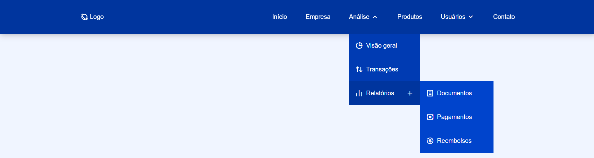

Projeto - <a href="https://dropdown-menu-responsive.netlify.app/">Menú suspenso</a>

Um menu suspenso responsivo é uma parte essencial de muitos sites modernos, garantindo uma experiência de usuário consistente em dispositivos de diferentes tamanhos.

👨🏼‍💻 <b>Tecnologias utilizadas:</b>

&nbsp;
&nbsp;
&nbsp;
&nbsp;

🛠️ <b>Recursos funcionalidades:</b>

- Menu suspenso responsivo usando HTML, CSS e JavaScript
- Contém uma barra de navegação responsiva.
- Contém menu suspenso e um submenu.
- Desenvolvido primeiro com a metodologia Mobile First, depois para desktop.
- Compatível com todos os dispositivos móveis.  

🔒 <b>Licença</b>

Este projeto está sob [LICENSE](LICENSE), o que significa que você não tem permissão para usar, modificar e distribuir o código conforme desejar, desde que mantenha o aviso de direitos autorais e a licença. Contudo, se você encontrar bugs, tiver sugestões de melhorias ou quiser contribuir de alguma forma, ficarei feliz em receber seu feedback.

<b>Contato:</b>

Se você tiver alguma dúvida, sugestão ou interesse em colaborar, não hesite em me contatar.

Email: <a href="mailto:danielportela.ti@gmail.com"> danielportela.ti@gmail.com</a> 
